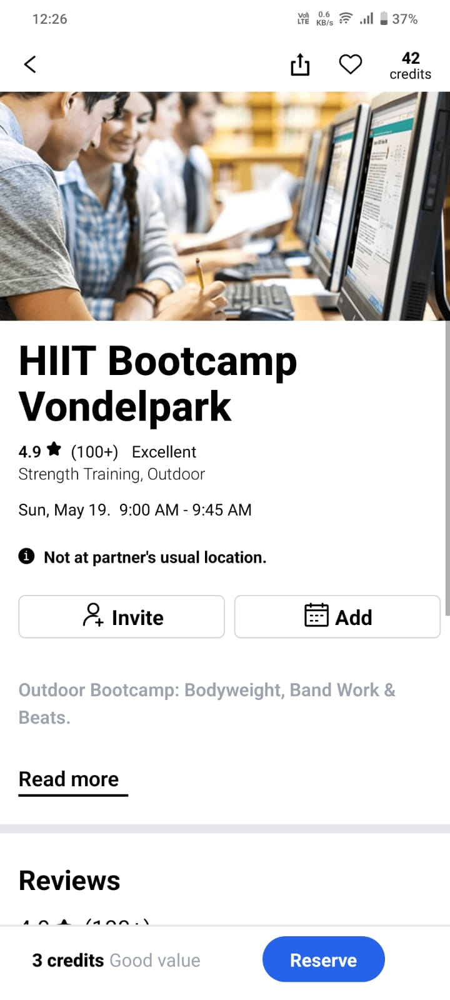
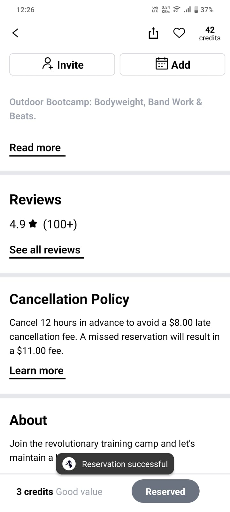
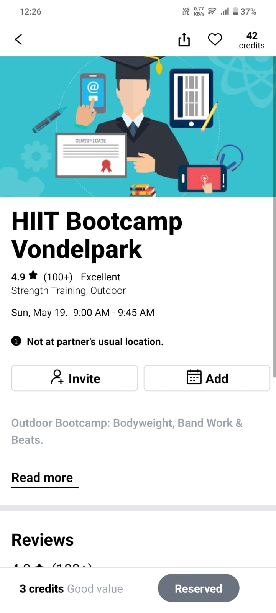

# NewClass App: Brackettup Assignment
This is a [react-native](https://reactnative.dev/) project bootstrapped with [expo](https://expo.dev/).

## Getting Started
Steps to run this project:

### Step1:
run the server:
```bash
npm i #to install all the dependencies.
npm start
#or
npm start --reset-cache #to reset all the cache from the previous build and start the app from scratch (Recommended)
#or
expo start
```

### Step2:
#### 1. Running in android/ios mobiles (Suggested/Efficient method):
Install the 'Expo Go' mobile app from playstore/app store.
Launch the app and connect with the same (wifi)network.
(In ios devices, give 'local network' access in the expo app settings and turn of vpn services from the device settings)
Scan the qr code provided in the development terminal of the running project from the app(or from camera app in ios).
Boom! The app starts running on your device.
Press 'r' in the running terminal to refresh the app if you encounter any issue. If the issue persists try clearing the cache in expo go mobile app and restart the app.

### 2. Running in web:
While the project is running press 'w' to run in web. Open the localhost link provided in the terminal.

### 3. Running in android/ios emulator:
Press 'a' for android or 'i' for ios devices. The emulator will start and the app will start running in the virtual device. Please ensure that android studio virtual device or a emulator is installed on your pc and is ready to run.

Among these all three options, first option, opening the app using your mobile handset is highly recommended. It's also a easy and handy method with a feel of hosted app.

Though the app will run in both android/ios device, it is optimized for android devices.

## Screenshots
|  |  |  |
| :-------------: | :-------------: | :-------------:  |

### Demo video link
[Demo video](https://drive.google.com/file/d/1zR2Wv_Z2WnHOABXPkVle5ByTQIBT-Gy8/view?usp=drivesdk)
